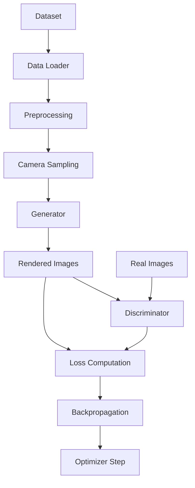
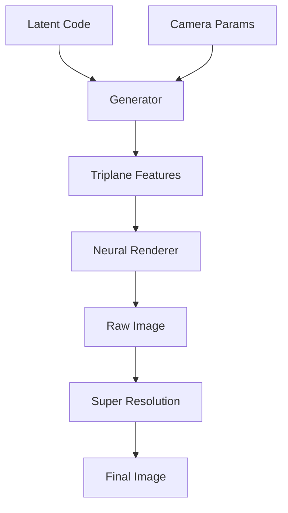

# 🛠️ Architecture Overview

This document provides a comprehensive overview of Aetherist's system architecture, design principles, and component interactions.

## 🎆 High-Level Architecture

```
                           ┌─────────────────┐
                           │   User Layer    │
                           │  CLI | Web | API │
                           └─────────┬───────┘
                                     │
                           ┌─────────┴───────┐
                           │  API Gateway    │
                           │   (FastAPI)     │
                           └─────────┬───────┘
                                     │
                    ┌────────────────┼────────────────┐
                    │                │                │
           ┌────────┴────────┐  ┌────┴────┐  ┌───────┴───────┐
           │ Generation Core │  │ Storage │  │ Monitoring    │
           │   (PyTorch)     │  │ Layer   │  │ & Analytics   │
           └────────┬────────┘  └─────────┘  └───────────────┘
                    │
      ┌─────────────┼─────────────┐
      │             │             │
 ┌────┴────┐  ┌────┴────┐  ┌─────┴─────┐
 │ Neural  │  │ Camera  │  │ Style     │
 │Renderer │  │ System  │  │Controller │
 └─────────┘  └─────────┘  └───────────┘
```

## 🧠 Core Components

### 1. Neural Rendering Pipeline

The heart of Aetherist's 3D avatar generation system.

#### Triplane Representation

```python
class TriplaneGenerator(nn.Module):
    """
    Generates three orthogonal feature planes for 3D representation.
    
    Architecture:
    - Input: Latent code (512-dim)
    - Output: 3 feature planes (256 channels, 64x64 each)
    - Process: StyleGAN2-based synthesis network
    """
    def __init__(self, latent_dim=512, triplane_dim=256, triplane_res=64):
        super().__init__()
        self.synthesis = SynthesisNetwork(
            latent_dim=latent_dim,
            output_dim=triplane_dim * 3,
            num_layers=8
        )
        
    def forward(self, latent_codes):
        # Generate feature planes
        planes = self.synthesis(latent_codes)
        
        # Reshape to 3 planes
        batch_size = latent_codes.size(0)
        planes = planes.view(batch_size, 3, triplane_dim, triplane_res, triplane_res)
        
        return {
            'xy_plane': planes[:, 0],  # Top-down view
            'xz_plane': planes[:, 1],  # Front view  
            'yz_plane': planes[:, 2]   # Side view
        }
```

#### Neural Renderer

```python
class NeuralRenderer(nn.Module):
    """
    Renders 2D images from 3D triplane features.
    
    Process:
    1. Ray sampling based on camera parameters
    2. Feature sampling from triplane intersection
    3. Volume rendering with neural networks
    4. Super-resolution for final output
    """
    
    def __init__(self, feature_dim=256, hidden_dim=256, num_layers=8):
        super().__init__()
        self.mlp_layers = self._build_mlp(feature_dim, hidden_dim, num_layers)
        self.density_head = nn.Linear(hidden_dim, 1)
        self.color_head = nn.Linear(hidden_dim, 3)
        
    def forward(self, triplane_features, ray_directions, ray_origins):
        # Sample points along rays
        points, depths = self.sample_points(ray_origins, ray_directions)
        
        # Query triplane features at 3D points
        features = self.query_triplane(triplane_features, points)
        
        # Predict density and color
        hidden = self.mlp_layers(features)
        density = self.density_head(hidden)
        color = self.color_head(hidden)
        
        # Volume rendering
        rendered_image = self.volume_rendering(color, density, depths)
        
        return rendered_image
```

### 2. Camera System

Flexible camera control for multi-view generation.

#### Camera Parameter Encoding

```python
class CameraSystem:
    """
    Manages camera poses and projections for 3D-aware generation.
    
    Camera parameters (25-dim vector):
    - Extrinsic matrix (4x4): 16 values (world-to-camera transform)
    - Intrinsic parameters: 9 values (focal length, principal point, etc.)
    """
    
    @staticmethod
    def encode_camera_pose(position, target, up, fov=45, aspect=1.0):
        # Create view matrix
        forward = normalize(target - position)
        right = normalize(cross(forward, up))
        up = cross(right, forward)
        
        view_matrix = create_view_matrix(position, forward, right, up)
        
        # Create projection matrix
        proj_matrix = create_projection_matrix(fov, aspect)
        
        # Combine and flatten
        camera_matrix = proj_matrix @ view_matrix
        return camera_matrix.flatten()
    
    @staticmethod
    def create_orbit_trajectory(radius=2.5, num_views=8, elevation=0.2):
        """Create smooth orbital camera trajectory."""
        cameras = []
        for i in range(num_views):
            azimuth = 2 * np.pi * i / num_views
            position = spherical_to_cartesian(radius, elevation, azimuth)
            target = np.array([0, 0, 0])
            up = np.array([0, 1, 0])
            
            camera_params = CameraSystem.encode_camera_pose(position, target, up)
            cameras.append(camera_params)
        
        return torch.tensor(cameras, dtype=torch.float32)
```

### 3. Style Control System

Semantic control over avatar generation.

#### Attribute Vectors

```python
class StyleController:
    """
    Controls avatar attributes through learned latent directions.
    
    Architecture:
    - Pre-computed semantic directions in latent space
    - Interpolation and combination of multiple attributes
    - Strength control for fine-tuning
    """
    
    def __init__(self):
        # Load pre-computed attribute vectors
        self.attribute_vectors = {
            'age': {
                'young_to_old': torch.load('vectors/age_direction.pt'),
                'strength_scale': 2.0
            },
            'gender': {
                'male_to_female': torch.load('vectors/gender_direction.pt'),
                'strength_scale': 1.5
            },
            'expression': {
                'neutral_to_smile': torch.load('vectors/smile_direction.pt'),
                'strength_scale': 1.0
            },
            'ethnicity': {
                # Multiple direction vectors for different ethnic features
                'european': torch.load('vectors/european_direction.pt'),
                'asian': torch.load('vectors/asian_direction.pt'),
                'african': torch.load('vectors/african_direction.pt'),
            }
        }
    
    def apply_attributes(self, base_latent, attribute_config):
        """Apply multiple attributes to base latent code."""
        modified_latent = base_latent.clone()
        
        for attr_name, attr_value in attribute_config.items():
            if attr_name in self.attribute_vectors:
                direction = self.get_direction_vector(attr_name, attr_value)
                strength = self.get_strength(attr_name, attr_value)
                modified_latent += direction * strength
        
        return modified_latent
```

### 4. Training Infrastructure

Comprehensive training system with multiple loss functions.

#### Multi-Scale Discriminator

```python
class MultiScaleDiscriminator(nn.Module):
    """
    Multi-scale discriminator for improved adversarial training.
    
    Features:
    - Multiple resolution discriminators (64, 128, 256, 512)
    - 3D-aware discrimination with pose conditioning
    - Feature matching losses
    """
    
    def __init__(self, input_channels=3, base_channels=64):
        super().__init__()
        self.discriminators = nn.ModuleList([
            SingleScaleDiscriminator(input_channels, base_channels, scale=1),
            SingleScaleDiscriminator(input_channels, base_channels, scale=2),
            SingleScaleDiscriminator(input_channels, base_channels, scale=4),
            SingleScaleDiscriminator(input_channels, base_channels, scale=8)
        ])
        
    def forward(self, images, camera_params=None):
        discriminator_outputs = []
        feature_maps = []
        
        for discriminator in self.discriminators:
            # Downsample image for each scale
            scaled_image = self.downsample(images, discriminator.scale)
            
            # Get discriminator output and intermediate features
            output, features = discriminator(scaled_image, camera_params)
            
            discriminator_outputs.append(output)
            feature_maps.append(features)
        
        return discriminator_outputs, feature_maps
```

#### Loss Functions

```python
class AetheristLoss(nn.Module):
    """
    Combined loss function for Aetherist training.
    
    Components:
    1. Adversarial loss (WGAN-GP)
    2. Reconstruction loss (L1 + perceptual)
    3. Identity preservation loss
    4. Multi-view consistency loss
    5. Regularization losses
    """
    
    def __init__(self, config):
        super().__init__()
        self.config = config
        
        # Loss components
        self.perceptual_loss = VGGPerceptualLoss()
        self.identity_loss = ArcFaceIdentityLoss()
        self.lpips_loss = LPIPS()
        
    def generator_loss(self, generated_images, real_images, discriminator_outputs):
        losses = {}
        
        # Adversarial loss
        adv_loss = 0
        for d_output in discriminator_outputs:
            adv_loss += -d_output.mean()
        losses['adversarial'] = adv_loss * self.config.adversarial_weight
        
        # Reconstruction loss
        l1_loss = F.l1_loss(generated_images, real_images)
        perceptual_loss = self.perceptual_loss(generated_images, real_images)
        losses['reconstruction'] = (l1_loss + perceptual_loss) * self.config.reconstruction_weight
        
        # Identity preservation
        identity_loss = self.identity_loss(generated_images, real_images)
        losses['identity'] = identity_loss * self.config.identity_weight
        
        # Multi-view consistency
        if generated_images.size(0) > 1:  # Multiple views available
            consistency_loss = self.compute_consistency_loss(generated_images)
            losses['consistency'] = consistency_loss * self.config.consistency_weight
        
        # Total loss
        total_loss = sum(losses.values())
        losses['total'] = total_loss
        
        return total_loss, losses
    
    def discriminator_loss(self, real_outputs, fake_outputs):
        # WGAN-GP loss
        real_loss = -real_outputs.mean()
        fake_loss = fake_outputs.mean()
        
        # Gradient penalty
        gradient_penalty = self.compute_gradient_penalty(real_outputs, fake_outputs)
        
        total_loss = real_loss + fake_loss + 10 * gradient_penalty
        
        return total_loss, {
            'real_loss': real_loss,
            'fake_loss': fake_loss,
            'gradient_penalty': gradient_penalty,
            'total': total_loss
        }
```

## 🔧 Data Flow

### Training Pipeline



### Inference Pipeline



## 📊 Performance Characteristics

### Computational Complexity

| Component | Time Complexity | Memory Complexity | Notes |
|-----------|-----------------|-------------------|--------|
| Triplane Generation | O(L²) | O(L × C) | L: latent dim, C: channels |
| Neural Rendering | O(R²) | O(R² × D) | R: resolution, D: render depth |
| Super Resolution | O(R²) | O(R²) | 2x upsampling |
| Total Generation | O(R²) | O(R² × D) | Dominated by rendering |

### Memory Usage (512×512 output)

```
Component               Memory (GB)
─────────────────────  ──────────
Generator Parameters    0.8
Intermediate Features   2.1
Gradient Storage       1.6
Batch Processing       0.3 × batch_size
─────────────────────  ──────────
Total (batch=8)        7.3
```

### Throughput Benchmarks

```python
# Single GPU (RTX 4090)
Resolution  | Batch Size | Throughput (img/s) | Memory (GB)
─────────── | ────────── | ─────────────────  | ──────────
256×256     | 16         | 42.3               | 4.2
512×512     | 8          | 18.9               | 7.3
1024×1024   | 2          | 4.1                | 14.8
```

## 🔄 Component Interactions

### Generator-Discriminator Interaction

```python
class TrainingStep:
    def __init__(self, generator, discriminator, loss_fn):
        self.generator = generator
        self.discriminator = discriminator
        self.loss_fn = loss_fn
    
    def train_step(self, batch):
        # Sample latent codes and camera poses
        latent_codes = torch.randn(batch_size, 512)
        camera_poses = sample_camera_poses(batch_size)
        
        # Generator forward pass
        generated_images = self.generator(latent_codes, camera_poses)
        
        # Discriminator on real and fake
        real_outputs = self.discriminator(batch['images'], batch['cameras'])
        fake_outputs = self.discriminator(generated_images.detach(), camera_poses)
        
        # Compute losses
        g_loss, g_losses = self.loss_fn.generator_loss(
            generated_images, batch['images'], fake_outputs
        )
        d_loss, d_losses = self.loss_fn.discriminator_loss(
            real_outputs, fake_outputs
        )
        
        return g_loss, d_loss, {**g_losses, **d_losses}
```

### Style Control Integration

```python
class ControlledGeneration:
    def __init__(self, generator, style_controller):
        self.generator = generator
        self.style_controller = style_controller
    
    def generate_with_attributes(self, attributes, camera_poses):
        # Convert attributes to latent code
        base_latent = torch.randn(1, 512)
        controlled_latent = self.style_controller.apply_attributes(
            base_latent, attributes
        )
        
        # Generate with controlled latent
        generated_image = self.generator(controlled_latent, camera_poses)
        
        return generated_image
```

## 🚀 Optimization Strategies

### Model Optimizations

1. **Mixed Precision Training**
   ```python
   # Automatic mixed precision for faster training
   with torch.cuda.amp.autocast():
       generated_images = generator(latent_codes, camera_poses)
   
   # Gradient scaling for stability
   scaler = torch.cuda.amp.GradScaler()
   scaler.scale(loss).backward()
   scaler.step(optimizer)
   scaler.update()
   ```

2. **Gradient Checkpointing**
   ```python
   # Trade compute for memory
   from torch.utils.checkpoint import checkpoint
   
   def custom_forward(self, x):
       return checkpoint(self._forward_impl, x)
   ```

3. **Model Compilation**
   ```python
   # PyTorch 2.0 compilation for speedup
   generator = torch.compile(generator, mode="max-autotune")
   discriminator = torch.compile(discriminator, mode="max-autotune")
   ```

### Inference Optimizations

1. **Operator Fusion**
   ```python
   # Fuse consecutive operations
   torch.jit.script(generator)
   ```

2. **Batch Processing**
   ```python
   # Process multiple samples simultaneously
   def batch_generate(self, latent_codes, camera_poses, batch_size=8):
       results = []
       for i in range(0, len(latent_codes), batch_size):
           batch_latents = latent_codes[i:i+batch_size]
           batch_cameras = camera_poses[i:i+batch_size]
           batch_results = self.generator(batch_latents, batch_cameras)
           results.append(batch_results)
       return torch.cat(results, dim=0)
   ```

## 🔧 Configuration Management

### Hierarchical Configuration

```yaml
# Base configuration
base: &base
  model:
    latent_dim: 512
    triplane_dim: 256
    triplane_res: 64
  
  training:
    batch_size: 8
    learning_rate: 0.0002

# Environment-specific overrides
development:
  <<: *base
  training:
    batch_size: 2  # Lower for debugging
    log_interval: 10
  
production:
  <<: *base
  training:
    batch_size: 16  # Higher for efficiency
    mixed_precision: true
```

### Dynamic Configuration

```python
class ConfigManager:
    def __init__(self, config_path):
        self.config = self.load_config(config_path)
        self.register_update_callbacks()
    
    def update_config(self, key, value):
        """Update configuration at runtime."""
        self.set_nested_value(self.config, key, value)
        self.notify_callbacks(key, value)
    
    def register_callback(self, key_pattern, callback):
        """Register callback for configuration changes."""
        self.callbacks[key_pattern] = callback
```

This architecture provides a robust, scalable, and maintainable foundation for 3D avatar generation, with clear separation of concerns and optimized performance characteristics.